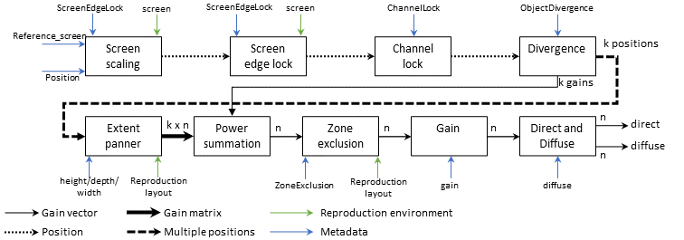
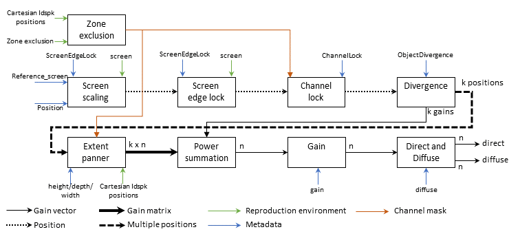

# ADM Object Rendering

If you are not interested in the details and just want to get coding, see the [code example](#code-example).

## Introduction

When rendering an Object a set of loudspeaker gains are calculated that will pan the object to the direction specified by the metadata.
The metadata controls properties such as the width of the sound source, as well as whether or not its position is to be modified based on the reproduction system.
The ratio of direct to diffuse signal is also specified in the metadata.
The Object direct and diffuse panning gains are computed by `GainCalculator`.
Depending on whether the metadata Cartesian flag is true or false the gains will be calculated in one of two ways, described in the following sections.

### Polar Processing Path

When the Cartesian flag is set to false the polar processing path is used to render the stream.
The figure below shows the processing logic for the calculation of the direct and diffuse gains in `GainCalculator`.



The first processing stage relates to whether or not the position of the Object is to be modified.
If a reproduction screen has been specified then the Object metadata can request the position of the Object be modified based on the screen properties, potentially modifying the position of the Object.
Following that, it is also possible to ensure that the object is sent only to a single loudspeaker, if one is close enough.
This is known as Channel Locking.
If no loudspeaker is within range then the Object stream is panned using its position.

Once the position of the Object has been determined, ObjectDivergence can be applied.
If the metadata specifies that Divergence be used then two additional positions are added to the Object position.
These positions are to the left and right of the Object position and their distance is specified in the metadata.
Each of these positions also has a specified gain based on the amount of divergence.
For zero divergence the original Object direction has a gain of unity and the others have zero gain.
For full divergence the original Object direction has zero gain and the left and right positions have gains of 0.5.

Once the divergence processing is complete the up-to-three divergence positions are each used to calculate a corresponding vector of panning gains based on their positions.
The gains are calculated using `SpreadPanner`, which allows for an azimuthal width and elevational height to be specified in the metadata.
The spread panner essentially pans copies of the Object to a set of grid positions that cover the full sphere.
A weight between 0 and 1 is applied to each of these grid positions based on the metadata width and height parameters before normalisation of the total weight by the sum of the grid weights.
The larger the width and height of the specified spread, the more of the grid points have non-zero gains, leading to a larger source width.
Each grid point then has panning gains calculated using vector base amplitude panning (VBAP) [[1]](#ref1) based on their position.
These gains are multiplied by their corresponding weights and summed to get the final panning gains for each of the three divergence positions.
Each of these three vectors of gains are summed using the divergence gains and they are power-normalised.

If ZoneExclusion is specified in the metadata then any loudspeaker in the excluded zone will have their gains shared out among other groups of loudspeakers.
The full method for calculating the downmixing matrix is given in section 7.3.12.2 of [[2]](#ref2).

A global gain is applied to the spatialisation gains before calculation of direct and diffuse gain vectors.
The direct and diffuse gain vectors are generated by multiplying the spatialisation gains by $`\sqrt{1-d}`$ and $`\sqrt{d}`$ respectively, where $`d`$ is the diffuseness parameter specified in the metadata.
The Object signal is then multiplied by the direct and diffuse gain vectors.
The diffuse signal has a set of decorrelation filters of length $N$ applied to each channel, creating a less well localisable signal.
After appropriate compensation delay of $`(N-1)/2`$ samples is applied to the direct signal the direct and diffuse signals are summed.

### Cartesian Processing Path

If the Cartesian flag is set to true then the cartesian processing path is used to render the stream.
The figure below shows the processing logic for the calculation of the direct and diffuse gains in `GainCalculator`.



First the zone exclusion metadata is used to create a vector of masks for the loudspeakers in the reproduction layout.
These are used when calculating channel locking and extent panning later in the path.

Like the Polar path, the position of the Object is modified using screen scaling, screen edge lock and channel locking.
The channel mask from the zone exclusion is used to ensure that the object is not locked to a channel that has been excluded.

Once the position of the Object has been modified ObjectDivergence is applied.
This can create additional copies of the object panned to the left and right of its position.

For each of the divergence positions a set of loudspeaker gains is calculated using the `CAllocentricExtent`, which uses the height, width and depth metadata parameters.
The panning uses the Cartesian/Allocentric panner rather than the PointSourcePanner of the Polar path.

These gain vectors are multiplied by their corresponding divergence gains and summed to get the final panning gains for the Object.
They are then power normalised and a gain is applied based on the metadata parameter.

Finally, the direct and diffuse gains are calculated in the same manner as for the Polar path.

## Code Example

This example simulated receiving a mono Object stream and its meta data.
As written here, the object is rendered on a 5.1 layout at an angle of 20&deg;. Try adjusting the channel locking, divergence and width to see the effect on the rendering.
For example, increasing the channel lock distance will cause the signal to snap to the left speaker completely.

```c++
#include "AdmRenderer.h"

const unsigned int sampleRate = 48000;
const int nBlockLength = 512;

// Ambisonic order (not used in this example but expected in Configure())
const unsigned int nOrder = 1;

std::vector<float> sinewave(nBlockLength);
// Fill the vector with a sine wave
for (int i = 0; i < nBlockLength; ++i)
    sinewave[i] = (float)std::sin((float)M_PI * 2.f * 440.f * (float)i / (float)sampleRate);

// Prepare the stream to hold the rendered audio (5.1)
const unsigned int nLdspk = 6;
float** renderStream = new float* [nLdspk];
for (unsigned int i = 0; i < nLdspk; ++i)
{
    renderStream[i] = new float[nBlockLength];
}

// Prepare the metadata for the stream
admrender::ObjectMetadata objectMetadata;
objectMetadata.trackInd = 0;
objectMetadata.blockLength = nBlockLength;
objectMetadata.cartesian = false;
objectMetadata.position.polarPosition().azimuth = 20.;
objectMetadata.position.polarPosition().elevation = 0.;
objectMetadata.position.polarPosition().distance = 1.;

// Channel lock (off by default)
objectMetadata.channelLock = admrender::ChannelLock();
objectMetadata.channelLock->maxDistance = 0.f; // <- Increase this to see the signal snap to fully in the left loudspeaker

// Object divergence (off by default)
objectMetadata.objectDivergence = admrender::ObjectDivergence();
objectMetadata.objectDivergence->azimuthRange = 30.; // <- Controls the width of the divergence
objectMetadata.objectDivergence->value = 0.; // <- Increase this to apply object divergence

// Object extent (off by default)
objectMetadata.width = 0.; // <- Increase this to increase the width and spread the Object over more adjacent loudspeakers

// Configure the stream information. In this case there is only a single channel stream
admrender::StreamInformation streamInfo;
streamInfo.nChannels = 1;
streamInfo.typeDefinition.push_back(admrender::TypeDefinition::Objects);

// Set up the ADM renderer
admrender::CAdmRenderer admRender;
admRender.Configure(admrender::OutputLayout::ITU_0_5_0, nOrder, sampleRate, nBlockLength, streamInfo);

// Add the Object stream to be rendered
admRender.AddObject(sinewave.data(), nBlockLength, objectMetadata);

// Render the stream
admRender.GetRenderedAudio(renderStream, nBlockLength);

// Cleanup
for (unsigned i = 0; i < nLdspk; ++i)
    delete renderStream[i];
delete[] renderStream;
```

## References

<a name="ref1">[1]</a> Ville Pulkki. Virtual sound source positioning using vector base amplitude panning. J. Audio Eng. Soc 45(6):456-466, 1997.

<a name="ref2">[2]</a> International Telecommunication Union. Audio Definition Model renderer for advanced sound systems. International Telecommunication Union, Geneva, Switzerland, Recommendation ITU-R BS.2127-1 edition, 2023. URL https://www.itu.int/rec/r-rec-bs.2127/en.
