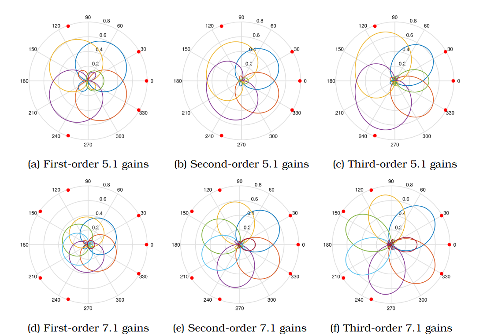

# Ambisonic Decoding to Loudspeakers

If you are not interested in the theory you can read about how to use `CAmbisonicDecoder` [here](#cambisonicdecoder) and `CAmbisonicAllRAD` [here](#cambisonicallrad).

## Theory and Implementation Details

An ambisonic signal cannot be played back directly.
A decoder is required to convert the signal from the spherical harmonic representation to either loudspeaker signals (implemented in `CAmbisonicDecoder` and `CAmbisonicAllRAD`) or headphone signals (implemented in `CAmbisonicBinauralizer`).

An ambisonic signal of order $N$ can be decoded to a set of loudspeakers using a decoding matrix $`\textbf{D}_{N}^{\mathrm{SN3D}}`$ which has size $`M \times (N+1)^2`$ where $`M`$ is the total number of loudspeakers. The output loudspeaker signal $`\textbf{x}(t)`$ is given by

```math
\textbf{x}(t) = \textbf{D}_{N}^{\mathrm{SN3D}} \textbf{b}_{N}(t).
```

The decoding matrix can be calculated using a number of different methods [[1]](#ref1)[[2]](#ref2)[[3]](#ref3). If the loudspeaker layout is regularly distributed on a sphere then decoding can be performed simply by sampling the ambisonic signal at each of the directions of the loudspeakers, known as a sampling ambisonic decoder (SAD) [[4]](#ref4).
The sampling decoding matrix $`\textbf{D}_{N}`$ is

```math
\textbf{D}_{N}^{\mathrm{SN3D}} = \frac{1}{\sqrt{M}} \left[ \tilde{\textbf{y}}_{N}(\theta_{1}, \phi_{1}), \tilde{\textbf{y}}_{N}(\theta_{2}, \phi_{2}), \ldots, \tilde{\textbf{y}}_{N}(\theta_{M}, \phi_{M}) \right]^{\mathrm{T}}\mathrm{diag}(\textbf{q}_{N}) = \frac{1}{\sqrt{M}} \tilde{\textbf{Y}}_{N}^{\mathrm{T}}\mathrm{diag}(\textbf{q}_{N})
```

where $`\tilde{\textbf{y}}_{\texttt{N}}(\theta_{m}, \phi_{m})`$ is the vector of spherical harmonics of the $m$-th loudspeaker direction **with N3D normalisation** and $`\textbf{q}_{\texttt{N}}`$ is a vector of gains to convert $`\textbf{b}_{N}(t)`$ from SN3D to N3D normalisation.

### Decoding to Irregular Loudspeaker Layouts Using Non-Linear Optimisation

If the layout is irregular, such as the ITU 5.1 and 7.1 layouts, then finding a suitable decoding method becomes more complex.
A significant limitation is that most decoder calculation methods require at least as many loudspeakers as there are ambisonic channels.
This limits 5.1 to first-order.

Wiggins [[5]](#ref5) used an optimisation technique that uses the Gerzon velocity and energy vectors [[6]](#ref6), along with the total pressure and energy sum of the loudspeaker gains, to calculate an optimised decoder for the 5.1 layout.
Due to the optimisation method the higher order spherical harmonics are able to contribute, meaning decoders can be obtained for first- to third-order.

The 5.1 decoders in `libspatialaudio` were kindly provided by Bruce Wiggins. 
The decoders for the 7.1 layout were generated using a method inspired by the non-linear optimisation work of Wiggins.
A decoder derived in the manner should not have [psychoacoustic optimisation](AmbisonicOptimisation.md) gains or filters applied since the desired optimisations were factored into the decoder optimisation.



The above figure shows the gains of each of the loudspeakers for the 5.1 and 7.1 arrays for the orders 1 to 3 with the decoders in `libspatialaudio`.
The use of higher-order harmonics is particularly evident in the asymmetric shape of the two rear-surround speakers of the 5.1 layout for third-order.


This figure shows the mean level of the decoders for sources around the horizontal. The 1st, 2nd and 3rd order levels are shown by the blue, red and yellow lines respectively.
It shows that there is in a small level variation with source position around the horizontal at most 3.5 dB for the third-order 5.1 decoder.
Consistent level across source directions is important in maintaining the balance of the sound scene when several sources have been panned to different directions.

### Decoding to Irregular Loudspeaker Layouts Using AllRAD

The AllRAD method [[1]](#ref1) first decodes the signal to a spherically regular t-design virtual loudspeaker layout and then uses VBAP [[7]](#ref7) to pan the virtual loudspeakers to the real layout.
The aim is to allow for optimal decoding to the virtual loudspeaker layout and then to spatialise this with a robust panning algorithm.

Additional imaginary loudspeakers can also be included in the main real loudspeaker layout to help when decoding to, for example, a dome.

The AllRAD method is the preferred decoding method of the EBU Audio Definition Model renderer (Recommendation ITU-R BS.2127-1) and Alliance For Open Media's Immersive Audio Model and Formats (IAMF) specification (https://aomediacodec.github.io/iamf/).

## CAmbisonicDecoder

`CAmbisonicDecoder` decodes an Ambisonics signal to either predefined or custom layouts using one of several methods:

- the SAD method: sampling at each of the specified loudspeaker directions. This is suboptimal for any layout that is not regular on the sphere.
- optimised decoder: the 5.1 and 7.1 preset layouts use the non-linearly optimised decoder matrices described above, since the SAD method is particularly unsuited to these layouts. The preset decoder matrices are loaded automatically if either of those layouts are selected or if a custom array that matches the directions is defined.
- user decoder definition: the user can define the decoder matrix coefficients directly for the specified layout. This means the class can be used with any decoding method that the user requires. See [here](#cambisonicdecoder-set-custom-decoder-coefficients) for more details on how to set a custom decoder matrix.

When a decoder matrix other than one of the presets is used `CAmbisonicDecoder` applies shelf filtering to psychoacoustically optimise the decoded signal. Read more about psyschoacoustic optimisation [here](AmbisonicOptimisation.md).

### CAmbisonicDecoder: Configuration

Before calling any other functions the object must first be configured by calling `Configure()` with the appropriate values. If the values are supported then the it will return `true` and the object can now be used.

The configuration parameters are:

- **nOrder**: The ambisonic order from 1 to 3.
- **b3D**: A bool to indicate if the signal is to be decoded is 2D (azimuth only) or 3D (azimuth and elevation).
- **nBlockSize**: The maximum number of samples the decoder is expected to process at a time.
- **sampleRate**: The sample rate of the audio being used e.g. 44100 Hz, 48000 Hz etc. This must be an integer value greater than zero.
- **nSpeakerSetup**: Choice of loudspeaker layout from one of the predefined options or to indicate use of a custom layout. Note that the 5.1 and 7.1 layouts **do not** use the ITU ordering. They use L/R/Ls/Rs/C/LFE and L/R/Ls/Rs/Lr/Rr/C/LFE respectively. This matches the channel ordering in VLC media player.
- **nSpeakers**: The total number of loudspeakers if a custom layout is used. This is ignored if one of the predefined layouts is selected.

### CAmbisonicDecoder: Set Custom Decoder Coefficients

The `SetCoefficient()` function can be used to define a custom decoder for the currently selected layout.

The parameters are:

- **nSpeaker**: The index of the loudspeaker for which the coefficient is to be set.
- **nChannel**: The index of the corresponding Ambisonic channel for which the coefficient is to be set.
- **fCoeff**: The decoder matrix coefficient.

The following code will set the decoder matrix to hold the values stored in `myDecMat`.

```c++
for (int iSpeaker = 0; iSpeaker < nLdspk; ++iSpeaker)
    for (int iCoeff = 0; iCoeff < nAmbiComponents; ++iCoeff)
    {
        myDecoder.SetCoefficients(iSpeaker, iCoeff, myDecMat[iSpeaker][iCoeff]);
    }
```

**Note**: Calling `Refresh()` will overwrite any coefficients set in this way and replace them with the default values for the selected layout (either a SAD matrix or a preset).

### CAmbisonicDecoder: Decoding a Signal

A B-format signal can be decoded to the loudspeaker signals using the `Process()` function. The processing is non-replacing, so the original B-format signal is unchanged and the decoded signal is contained in the output array.

The inputs are:

- **pBFSrc**: A pointer to the source B-format signal.
- **nSamples**: The length of the input signal in samples.
- **ppDst**: Array of pointers of size nLdspk x nSamples containing the decoded signal.

### CAmbisonicDecoder Code Example

This example shows how to decode an Ambisonics signal to a 5.1 loudspeaker layout. It loads the optimised preset decoder for this layout automatically.

```c++
#include "Ambisonics.h"

const unsigned int sampleRate = 48000;
const int nBlockLength = 512;

// Higher ambisonic order means higher spatial resolution and more channels required
const unsigned int nOrder = 1;

std::vector<float> sinewave(nBlockLength);
// Fill the vector with a sine wave
for (int i = 0; i < nBlockLength; ++i)
    sinewave[i] = (float)std::sin((float)M_PI * 2.f * 440.f * (float)i / (float)sampleRate);

// B-format buffer
CBFormat myBFormat;
myBFormat.Configure(nOrder, true, nBlockLength);
myBFormat.Reset();

// Encode the signal to Ambisonics
CAmbisonicEncoder myEncoder;
myEncoder.Configure(nOrder, true, sampleRate, 0);
PolarPoint position;
position.fAzimuth = 0;
position.fElevation = 0;
position.fDistance = 1.f;
myEncoder.SetPosition(position);
myEncoder.Reset();
myEncoder.Process(sinewave.data(), nBlockLength, &myBFormat);

// Set up the decoder for a 5.1 layout
CAmbisonicDecoder myDecoder;
myDecoder.Configure(nOrder, true, nBlockLength, sampleRate, Amblib_SpeakerSetUps::kAmblib_51);

// Configure buffers to hold the decoded signal
const unsigned int nLdspk = myDecoder.GetSpeakerCount();
float** ldspkOut = new float* [nLdspk];
for (int iLdspk = 0; iLdspk < nLdspk; ++iLdspk)
    ldspkOut[iLdspk] = new float[nBlockLength];

// Decode the Ambisonics signal
myDecoder.Process(&myBFormat, nBlockLength, ldspkOut);

// Cleanup
for (unsigned iLdspk = 0; iLdspk < nLdspk; ++iLdspk)
    delete ldspkOut[iLdspk];
delete[] ldspkOut;
```

## CAmbisonicAllRAD

`CAmbisonicAllRAD` decodes an Ambisonics signal to a layout defined in the ADM renderer specification (Recommendation ITU-R BS.2127-1) and AOM's IAMF specification (https://aomediacodec.github.io/iamf/). It does not currently support decoding to arbitrary loudspeaker layouts.

`CAmbisonicAllRAD` optionally applies shelf filtering to psychoacoustically optimise the decoded signal. Read more about psychoacoustic optimisation [here](AmbisonicOptimisation.md).

### CAmbisonicAllRAD: Configuration

Before calling any other functions the object must first be configured by calling `Configure()` with the appropriate values. If the values are supported then the it will return `true` and the object can now be used.

The configuration parameters are:

- **nOrder**: The ambisonic order from 1 to 3.
- **nBlockSize**: The maximum number of samples the decoder is expected to process at a time.
- **sampleRate**: The sample rate of the audio being used e.g. 44100 Hz, 48000 Hz etc. This must be an integer value greater than zero.
- **layoutName**: The name of the loudspeaker layout. This must be one of those specified in the ADM or IAMF specifications. The valid names are:
  - `"0+2+0"`: BS.2051-3 System A (Stereo)
  - `"0+4+0"`: Quad
  - `"0+5+0"`: BS.2051-3 System B (5.1)
  - `"2+5+0"`: BS.2051-3 System C (5.1.2)
  - `"4+5+0"`: BS.2051-3 System D (5.1.4)
  - `"4+5+1"`: BS.2051-3 System E
  - `"3+7+0"`: BS.2051-3 System F
  - `"4+9+0"`: BS.2051-3 System G
  - `"9+10+3"`: BS.2051-3 System H
  - `"0+7+0"`: BS.2051-3 System I (7.1)
  - `"4+7+0"`: BS.2051-3 System J (7.1.4)
  - `"2+7+0"`: 7.1.2 (IAMF v1.0.0-errata)
  - `"2+3+0"`: 3.1.2 (IAMF v1.0.0-errata)
  - `"9+10+5"`: EBU Tech 3369 (BEAR) 9+10+5 - 9+10+3 with LFE1 & LFE2 removed and B+135 & B-135 added
- **useLFE**: The total number of loudspeakers if a custom layout is used. This is ignored if one of the predefined layouts is selected.
- **useOptimFilts**: (Optional) False by default. If true then [psychoacoustic optimisation filters](AmbisonicOptimsiation.md) will be applied before decoding the signal.

### CAmbisonicAllRAD: Decoding a Signal

A B-format signal can be decoded to the loudspeaker signals using the `Process()` function. The processing is non-replacing, so the original B-format signal is unchanged and the decoded signal is contained in the output array.

The inputs are:

- **pBFSrc**: A pointer to the source B-format signal.
- **nSamples**: The length of the input signal in samples.
- **ppDst**: Array of pointers of size nLdspk x nSamples containing the decoded signal.

### CAmbisonicAllRAD Code Example

This example shows how to decode an Ambisonics signal to an ITU 5.1 loudspeaker layout using the AllRAD method.

```c++
#include "Ambisonics.h"

const unsigned int sampleRate = 48000;
const int nBlockLength = 512;

// Higher ambisonic order means higher spatial resolution and more channels required
const unsigned int nOrder = 1;

std::vector<float> sinewave(nBlockLength);
// Fill the vector with a sine wave
for (int i = 0; i < nBlockLength; ++i)
    sinewave[i] = (float)std::sin((float)M_PI * 2.f * 440.f * (float)i / (float)sampleRate);

// B-format buffer
CBFormat myBFormat;
myBFormat.Configure(nOrder, true, nBlockLength);
myBFormat.Reset();

// Encode the signal to Ambisonics
CAmbisonicEncoder myEncoder;
myEncoder.Configure(nOrder, true, sampleRate, 0);
PolarPoint position;
position.fAzimuth = 0;
position.fElevation = 0;
position.fDistance = 1.f;
myEncoder.SetPosition(position);
myEncoder.Reset();
myEncoder.Process(sinewave.data(), nBlockLength, &myBFormat);

// Set up the decoder for a 5.1 layout
CAmbisonicAllRAD myDecoder;
myDecoder.Configure(nOrder, nBlockLength, sampleRate, "0+5+0");

// Configure buffers to hold the decoded signal
const unsigned int nLdspk = myDecoder.GetSpeakerCount();
float** ldspkOut = new float* [nLdspk];
for (int iLdspk = 0; iLdspk < nLdspk; ++iLdspk)
    ldspkOut[iLdspk] = new float[nBlockLength];

// Decode the Ambisonics signal
myDecoder.Process(&myBFormat, nBlockLength, ldspkOut);

// Cleanup
for (unsigned iLdspk = 0; iLdspk < nLdspk; ++iLdspk)
    delete ldspkOut[iLdspk];
delete[] ldspkOut;
```

## References

<a name="ref1">[1]</a> Franz Zotter, Hannes Pomberger, and Markus Noisternig. Energy-Preserving Ambisonic Decoding. Acta Acustica united with Acustica, 98(1):37–47, January 2012. doi: http://dx.doi.org/10.3813/AAA.918490.

<a name="ref2">[2]</a> Franz Zotter and Matthias Frank. All-round ambisonic panning and decoding. Journal of the Audio Engineering Society, 60(10):807–820, 2012.

<a name="ref3">[3]</a> MA Poletti. Three-Dimensional Surround Sound Systems Based on Spherical Harmonics. J. Audio Eng. Soc, 53(11):1004–1025, 2005.

<a name="ref4">[4]</a> Franz Zotter and Matthias Frank. Ambisonics: A practical 3D audio theory for recording, studio production, sound reinforcement, and virtual reality. Springer Nature, 2019.

<a name="ref5">[5]</a> Bruce Wiggins. The generation of panning laws for irregular speaker arrays using heuristic methods. In AES 31st International Conference, London, 2007.

<a name="ref6">[6]</a> Michael Gerzon. General metatheory of auditory localisation. In 92nd Convention of the Audio Engineering Society, Vienna, March 1992.

<a name="ref7">[7]</a> Ville Pulkki. Virtual sound source positioning using vector base amplitude panning. J. Audio Eng. Soc 45(6):456-466, 1997.
