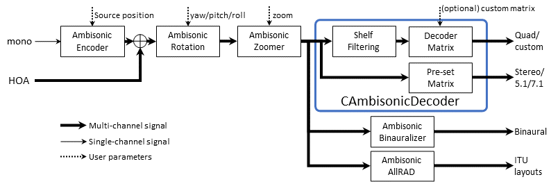

# Ambisonic Processing Overview

If you are not interested in the details and just want to get coding, see the [code example](#code-example).

## Ambisonic Processors

The main Ambisonic processing classes are:

- `CAmbisonicEncoder`: Converts a mono signal to an Ambisonics signal of order 1 to 3.
  - Read more [here](AmbisonicEncoding.md).
  - Go directly to the coding details [here](AmbisonicEncoding.md#cambisonicencoder).
  
- `CAmbisonicRotator`: Applies a user-specified rotation to the sound field. This is useful for head tracking or keeping the audio aligned with a 360 video.
  - Read more [here](AmbisonicRotation.md).
  - Go directly to the coding details [here](AmbisonicRotation.md#cambisonicrotator).

- `CAmbisonicZoomer`: An acoustical "zoom" that focuses on the front of the sound scene.
  - Read more [here](AmbisonicZoomer.md).
  - Go directly to the coding details [here](AmbisonicZoomer.md#cambisoniczoomer).

- `CAmbisonicDecoder`: A decoder that converts an Ambisonics signal to a set of loudspeaker signals. It contains optimised presets for 5.1 and 7.1 loudspeaker layouts. Custom layouts can also have their decoding matrix defined by the user, for additional flexibility.
  - Read more [here](AmbisonicDecoding.md).
  - Go directly to the coding details [here](AmbisonicDecoding.md#cambisonicdecoder).

- `CAmbisonicBinauralizer`: A decoder that converts an Ambisonics signal to a binaural signal. This allows for immersive audio to be experienced over headphones. Custom HRTFs can be loaded using the .SOFA format, allowing for a customised listening experience.
  - Read more [here](AmbisonicBinauralization.md).
  - Go directly to the coding details [here](AmbisonicBinauralization.md#cambisonicbinauralizer)

- `CAmbisonicAllRAD`: A decoder that converts an Ambisonics signal to a set of loudspeaker signals corresponding to the ITU layouts or IAMF specificiation layouts. It uses the AllRAD method to calculate the decoding matrix.
  - Read more [here](AmbisonicDecoding.md).
  - Go directly to the coding details [here](AmbisonicDecoding.md#cambisonicallrad)

## Ambisonics Signal Flow

In general, unless your signal is already in Ambisonics format, the signal chain will begin with `CAmbisonicEncoder` to bring the audio in to the Ambisonics domain.

The rotation and zooming processing elements are optional and will be context dependent. However, they should generally be applied to a summation of all the sound sources making up the scene, rather than applying to each one individually.

Finally, the signal needs to be converted from a Ambisonics to the listener's particular layout. The choice of which decoder should be used is generally decided by the target output layout. ITU layouts could use `CAmbisonicAllRAD` or, if a custom decoder is available, `CAmbisonicDecoder`. Binauralisation over headphones uses `CAmbisonicBinauralization`.



The above figure shows the signal flow used to encode a mono input signal to HOA, perform rotation of the sound field (using `CAmbisonicRotator`) and then to acoustically zoom on the front of the sound field (using `CAmbisonicZoomer`).
Finally, it is decoded to the listener using one of the decoding methods.

## Code Example

This example shows how to apply the entire signal chain described above and to convert the output to binaural.

See [here](AmbisonicDecoding.md) for specific examples on how to decode using `CAmbisonicDecoder` or `CAmbisonicAllRAD`.

```c++
#include "Ambisonics.h"

const unsigned int sampleRate = 48000;
const int nBlockLength = 512;

// Higher ambisonic order means higher spatial resolution and more channels required
const unsigned int nOrder = 1;
// Set the fade time to the length of one block
const float fadeTimeInMilliSec = 1000.f * (float)nBlockLength / (float)sampleRate;

std::vector<float> sinewave(nBlockLength);
// Fill the vector with a sine wave
for (int i = 0; i < nBlockLength; ++i)
    sinewave[i] = (float)std::sin((float)M_PI * 2.f * 440.f * (float)i / (float)sampleRate);

// B-format buffer
CBFormat myBFormat;
myBFormat.Configure(nOrder, true, nBlockLength);
myBFormat.Reset();

// Encode the signal to Ambisonics
CAmbisonicEncoder myEncoder;
myEncoder.Configure(nOrder, true, sampleRate, 0);
PolarPoint position;
position.fAzimuth = 0;
position.fElevation = 0;
position.fDistance = 1.f;
myEncoder.SetPosition(position);
myEncoder.Reset();

// Set up the rotator
CAmbisonicRotator myRotator;
myRotator.Configure(nOrder, true, nBlockLength, sampleRate, fadeTimeInMilliSec);
RotationOrientation rotOri;
rotOri.yaw = 0.5 * M_PI;
myRotator.SetOrientation(rotOri);

// Set up the zoomer processor
CAmbisonicZoomer myZoomer;
myZoomer.Configure(nOrder, true, nBlockLength, 0);
myZoomer.SetZoom(0.5f);

// Set up the binaural decoder
CAmbisonicBinauralizer myDecoder;
unsigned int tailLength = 0;
myDecoder.Configure(nOrder, true, sampleRate, nBlockLength, tailLength);
// Configure buffers to hold the decoded signal
const unsigned int nEar = 2;
float** earOut = new float* [nEar];
for (int iEar = 0; iEar < nEar; ++iEar)
    earOut[iEar] = new float[nBlockLength];

// Process the audio ==============================
// Encode the signal to Ambisonics
myEncoder.Process(sinewave.data(), nBlockLength, &myBFormat);

// Rotate the Ambisonics signal
myRotator.Process(&myBFormat, nBlockLength);

// Apply zooming to the Ambisonics signal
myZoomer.Process(&myBFormat, nBlockLength);

// Decode the signal to binaural
myDecoder.Process(&myBFormat, earOut, nBlockLength);

// Cleanup
for (unsigned iEar = 0; iEar < nEar; ++iEar)
    delete earOut[iEar];
delete[] earOut;
```
